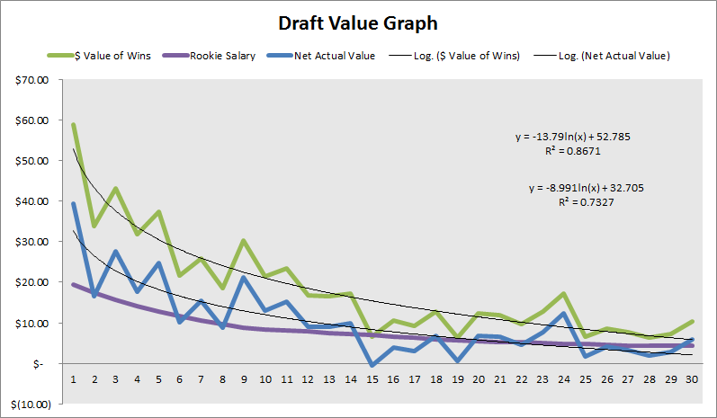
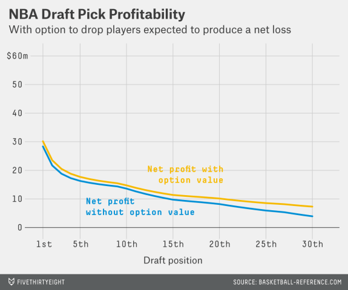
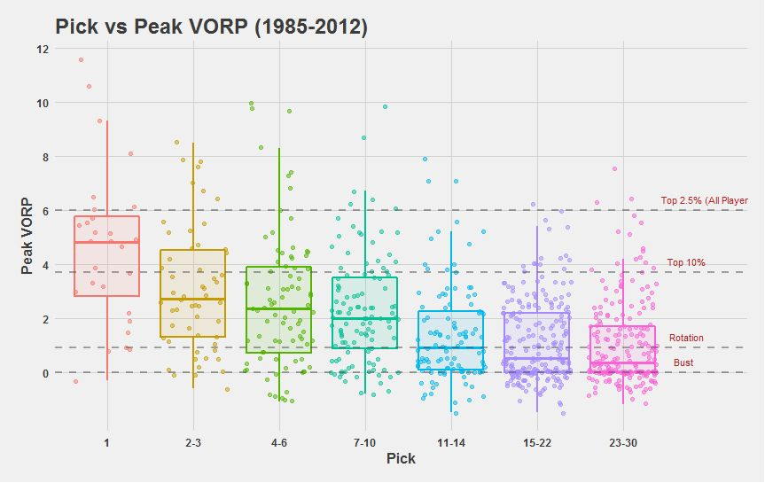
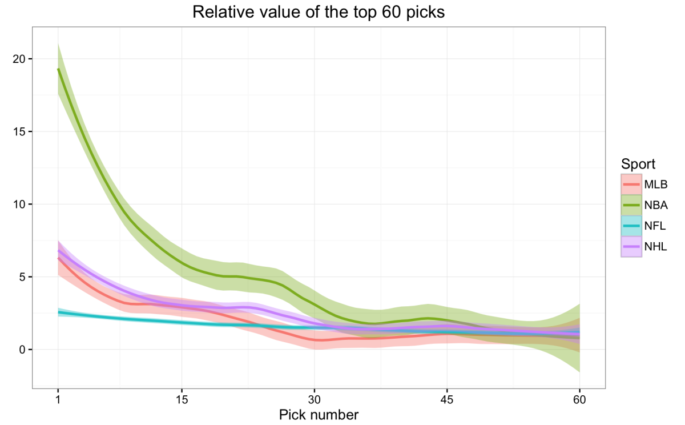

# What Research Says about NBA Draft Pick Value

The value of NBA draft picks is a common talking matter in the NBA analytics
community. In this introductory write-up I summarize conclusions made by other
researchers about the biggest questions that I (and probably many others) have
about the NBA draft pick value. I plan to follow this peer review up with a
step-by-step guide where I will go into detail explaining my methodology and
discoveries in attempting to answer to these questions for myself.
^[I plan to discuss some closely related topics as well.]

## The Question(s)

### The Basic Question

To be clear, the primary (or __"first"__) question that I am looking 
to answer can be stated explicitly as follows:
__“How valuable are NBA draft picks?"__ 

Before attempting to answer this question, I think that we should 
acknowledge that the term __"value”__ is relatively ambiguous. In 
fact, I would say that the interpretation of “value” can lead to a 
range of different answers. Thus, I should be clear in how I intend to 
interpret it. 

From my point of view, the answer to the question depends on whether 
wants to define a player’s value either in terms of __basketball production__ 
or __monetary cost__.; ^[Notably, one can even interpret 
basketball production and monetary cost in a number of different ways, 
although the former is typically evaluated in terms of an 
“all-in-one” advanced metric and the latter is typically evaluated 
in terms of salary obligations.] Thus, on one extreme, one can 
reasonably come up with one answer that completely neglects cost in 
favor of pure basketball production. (This kind of answer would 
emphasize draft slots at which selected players have historically 
produced the most basketball-wise, such as those at the top of the first 
round)). On the other extreme, an answer that completely neglects 
basketball production in favor of raw cost considerations might also be 
deduced. ^[Such an answer would favor those slots where picks have 
historically received the least amount of money from contracts, such as 
those in the late in the second.] I am interested in trying to determine 
the answer to the question of “value” in two ways. 

1. One answer that considers __only__ basketball production (i.e. the 
first kind of answer that I have suggested).
2. Another answer that 
__discounts__ basketball production with monetary cost. 

### A Related (and Better) Question 

I am also looking to answer the (__"second"__) question:
__"Are higher picks more valuable than lower picks?"__ 
Although this may seem like a 
simple restatement of the first question, I argue that its answer is 
different. 

I think the answer to this second question __MUST__ consider both 
basketball production and monetary cost __simultaneously__. Furthermore, 
it must also weigh the significance of each of these factors on a 
__relative__ basis with respect to the rest of the draft slots.  
Perhaps this second question is better phrased as
__“At which draft 
slots does the expected basketball production outperform the contractual 
obligation the most?”__ ^[Admittedly, this re-phrasing isn’t 
something someone would say in normal conversation.] 

In comparison, I would say that the first question is posed on an 
__absolute__ scale, and its answer does not necessarily provide 
ground-breaking insight. Put another way, in answering the first 
question, it is reasonable to expect (and, as we will see, can be shown) 
that both basketball production and cost are highest for the top picks 
and lower for later picks. 

## The Answer(s) 

In this section I summarize and draw similarities among the 
methodologies and findings made by six researchers. I have listed the 
researchers and their writings in order of  publication date. 
^[Consequently, answers to the questions that I have posed are not given 
in an outlined fashion.] 

### [Justin Kubatko](https://twitter.com/jkubatko)


In a [2009 article published](2) at his website [Basketball Reference](http://www.basketball-reference.com/blog/?p=2740)
(which is like the mecca for all NBA stats nerds like me)), 
Justin Kubatko concisely documents his use of __[win shares](http://www.basketball-reference.com/about/ws.htm)__ 
(WS) to measure __“expected value”__ (EV). In specific, he tracks 
the WS accumulated throughout the __entire careers__ of players drafted 
from 1977 to 1991 (because all players who had been drafted in that year 
range had retired by the time of his analysis) and employs linear 
regression with a logarithmic transformation (i.e. __[linear-log regression](http://www.kenbenoit.net/courses/ME104/logmodels2.pdf)__) 
to come up with a formula for EV---```EV = 76.9 - 18.8 * log(pick)```. 
Moreover, he records WS earned in only the first __four years__ of a player’s career (to account for the conventional length 
of rookie contracts under the NBA’s
__[collective bargaining agreement](https://en.wikipedia.org/wiki/NBA_collective_bargaining_agreement)__ (CBA))
for all players drafted from 1977 to 2005 
(meaning that all players drafted in the last year of that range had the 
opportunity to play four years) to come up with another linear-log 
formula for EV---```EV = 26.5 - 6.3 * log(pick)```. In summary, Kubatko 
clearly infers that the “value” to be gained from draft slots 
diminishes with increasing pick number. However, his take is solely 
phrased in terms of basketball production; he stops short of putting his 
results in terms of monetary units. 

In relation to the questions that I have posed, Kubatko's formulas and 
tables gives an answer that considers only basketball-production to my 
first question of general NBA draft pick value. 

### [Aaron Barzilai](https://twitter.com/basketballvalue)


In a [somewhat formal research article](http://www.82games.com/barzilai1.htm)
posted at [82games.com](http://www.82games.com), Aaron
Barzilai builds upon the work of Kubatko using data from 1980 to 2007. He
analyzes production in terms of four different metrics--[PER-minutes](http://www.sportingcharts.com/dictionary/nba/per-minute-statistics.aspx), 
player
wins, WS, and estimated salary---and he looks at each metric over three
different time periods---__career, __first four years__, and years with 
rookie team.^[Barzilai doesn't analyze the third time period much in 
his discussion. After discarding the combination of estimated salary for 
the non-career time stints, he comes up with 10 data sets. He normalizes 
on a percentage basis relative to the top pick such that the units of 
the dependent-variable (i.e. the basketball-production metric) are 
eliminated. After taking an __average of the seven data sets__ not 
involving time spent with rookie team, he comes up with an explicit 
formula for __“relative value”__ (which I will abbreviate as 
RV)--RV: ```0.947 exp(-0.05331 ^ (pick - 1))```. Although Barzilai 
doesn’t directly contextualize his results in terms of money, he finds 
that the later picks are relatively undervalued when comparing a 
normalized curve for estimated value with a normalized curve for rookie 
salary obligations (dictated by the CBA).] 


Like Kubatko, Barzilai presents an answer to my first question of big-picture
draft pick value in terms of basketball production. Furthermore, as can be
inferred from the above graph, he also provides an answer to my second question
regarding the __cost-effectiveness__ of picks.

### [Arturo Galletti](https://twitter.com/ArturoGallett)


In [a 2013 post](http://wagesofwins.com/2013/05/21/from-the-vault-the-value-of-a-draft-pick-and-draft-pedigree-in-the-finals/),
Arturo Galletti, one of the main contributors at 
[Wages of Wins](http://wagesofwins.com/), provides some interesting visuals in describing his 
take on the subject. Without specifying exactly which years he drew data 
from, he uses __[wins produced](http://wagesofwins.com/wins-produced/)__ (WP) to measure basketball value, 
translates WP to a monetary value using an estimate of $1.7 million per 
win, and finds the net monetary value by taking the difference of the 
monetary WP and the CBA’s rookie salary obligation for each draft 
slot. Following the precedent set by Kubatko and Barzilai, Galletti 
accounts for the typical length of the contracts of first-round picks by 
averaging all data over the __first four seasons__ after draft year. 
However, because he also considers the monetary obligations of these 
contracts under the CBA, which only applies to first-round picks, he 
only evaluates the top 30 picks. (Kubtako and Barzilai models all 60 
picks because they do not attempt to contextualize the monetary value of 
picks and wins.) After applying a linear-log regression, Galletti finds 
__"Value of Wins [$ Million]”:__ ```-13.79 * ln(pick) + 52.785``` and 
__“Net Actual Value [$ Million]”:__ ```-8.991 * ln(pick) + 32.705```. 
Galletti's regression graph is shown below. 



In contextualizing Galletti's findings with respect to my questions, it is
evident that he answers my first question in both fashions for which I sought an
answer---his __"Avg Wins Per Pick"__ and "Net Actual Value" data sets give
answers for value in terms of pure basketball production and basketball
production discounted by cost.

### [Nate Silver](https://twitter.com/NateSilver538)


Next, Nate Silver took [a look at the issue](http://fivethirtyeight.com/features/how-much-is-winning-the-nba-draft-lottery-really-worth/)
ahead of the 2014 draft at his
website [FiveThirtyEight](http://fivethirtyeight.com/). Using data from 1985 through 2014 and
extrapolating data for rookies from the 2012 to 2014), Silver makes formulation
that is similar to that of Galletti. Like Galletti, he finds the
__"Net Profit"__ (the analogue of Galletti's "Net Actual Value") of first-round draft
picks after translating wins to currency and discounting these values (which he
calls __"Net Value Produced at Free-Agent Market Rate"__) by rookie salary
obligations. However, unlike Galletti, Silver uses __WS__ as his choice for
evaluating basketball production, and he evaluates everything on a __five-year__
basis. ^[Both of these are relatively minute differences.]



With his "Net Value Produced at Free-Agent Market Rate" and "Net Profit" data
sets, Silver analysis provides answers to my first question in terms of pure
basketball production and cost-discounted basketball production.

### [Saurabh Rane](https://twitter.com/SaurabhOnTap)


More recently,  just ahead of the 2016 draft Saurabh Rane tackled the question
of NBA draft pick value [in a guest post](http://nyloncalculus.com/2016/06/17/freelance-friday-expected-value-in-the-nba-draft/)
in [Nylon Calculus]( http://nyloncalculus.com/). Employing
first-round data for the rookie classes from 1985 to 2012, he evaluates players
with respect to their highest single-season 
__[value over replacement player][(https://en.wikipedia.org/wiki/Value_over_replacement_player)__ (VORP) 
over the course of their __careers__. His approach is
arguably more granular than that of others, which makes it relatively distinct.
He neglects money considerations entirely and classifies players into one of
four quartiles ---All-NBA First-Teamer (top 2.5%), All-Star (top 10%), rotation
player, or bust---while looking at seven ranges of picks---first, early lottery
(picks 2 and 3), early-mid lottery (picks 4 to 6), mid-late lottery ( picks 7 to
10), late lottery (picks 11 to 14), mid-late first (picks 15 to 22), and
late-first (picks 23 to 30). 
^[In classifying rookies into four tiers, his approach somewhat mirrors that of a 2015 
<a href="http://fivethirtyeight.com/features/projecting-the-top-50-players-in-the-2015-nba-draft-class/">
FiveThirtyEight piece</a> authored by Neil Pane and Zach Bradshaw in which they 
forecast that year’s draft prospects using applied statistics.


However, although he doesn't provide explicit values in tabular form or 
implicit ones in the form of an equation, Rane's charts, on of which can 
be seen above, clearly answer my first question about the general 
relationship between value and draft pick in terms of on-court 
production. He verifies the deductions made by others (either 
empirically or mathematically) that the pure basketball production that 
can be expected of higher picks is much greater than that for lower 
picks, and that this drop-off is non-linear (for potential All-First 
Teamers and All-Stars). 

Put another way, he asserts that the chance of a player becoming 
__elite__ (i.e. All-First Teamer or All-Star) is not linearly related to 
their draft position; rather, top picks have a much greater chance at 
becoming All-Stars or All-NBA First-Teamers. 

### [Michael Lopez](https://twitter.com/statsbylopez)


[Writing even more recently](https://statsbylopez.com/2016/06/22/the-making-and-comparison-of-draft-curves/) than Rane is Michael Lopez, an 
Assistant Professor of Statistics at [Skidmore College](http://www.skidmore.edu/). He provides 
some input on the NBA in a broader analysis that compares the importance 
of draft picks in the four major American team sports. For the NBA draft 
specifically, he uses __career WS__ and a
[__locally weighted scatter-plot smoothing__](https://en.wikipedia.org/wiki/Local_regression) (LOESS)
regression to model data from 1990 
to 2005. Like Rane, he cannot provide a formula for the regression, as a 
consequence of using LOESS.  Nevertheless, he finds that the relative 
value of late second-round picks is much less (about 20 times less) than 
that of top picks, which confirms the empirical notion of experts and 
the findings of other researchers that superstars dominate the NBA. ^[Furthermore,
aside from verifying the dramatic drop-off in on-court 
production with increasingly lower draft position, Lopez finds that the 
drop-off is more dramatic in the NBA than in the other three major 
American team sports. In other words, he shows that the top NBA picks 
are more valuable that the early picks in the drafts of other sports.] 



In summary, Lopez's research goes as far as Kubatko's and Rane's in its
relevance to answering my questions---that is, it provides an answer to the
big-picture question of value gained from draft picks, but only in terms of
basketball production. ^[I do not mean to discredit Lopez (or Kubatko or Rane) for not supplying answers to all of my questions. 
I acknowledge that each author had unique intentions in their research. 
For example, Lopez was concerned with expected value in sports other than just the NBA.]

### The Aggregate Answer(s)

At the very least, each of the six analysts I have mentioned 
here---Kubatko, Barzilai, Galletti, Silver, Rane, and Lopez---modeled 
the relationship between draft position and basketball production, 
providing one of the two types of answers to my first question regarding 
the general value of draft picks. Although they differed in their 
choices for metric for assessing basketball production (e.g. WS, VORP, 
etc.), sample size of data (i.e range of draft years), the time span for 
evaluating production (e.g. four years, career, etc.), and their methods 
for regression (e.g. linear-log, LOESS, etc.), they all came to the 
basically the __same conclusion__---that is, that players who are 
selected earlier are likely to outperform those selected later (which is 
precisely what a rational observer would hypothesize). ^[The 
thinking behind the hypothesis that the production of players in 
the NBA (or any sport) correlates relatively closely with draft position 
is that players selected at higher slots demonstrate higher ability and 
potential to improve before being drafted, so they are more likely to 
succeed and add value to their teams. Lopez finds that this is true for 
each of the four major American sports For the NBA specifically, this 
correlation between on-court value and draft position has been verified 
in research looking at various lengths of time: Rane and Lopez evaluated 
value added over the length of players’ entire careers, Galletti and 
Silver solely considered the time spanning the length of players’ 
rookie contracts, and Kubatko and Barzilai looked at both of these 
periods of time.]

Furthermore, Galletti and Silver go beyond simply measuring the value of 
draft slots in terms of basketball production and contextualize it in 
terms of monetary cost, which is what I sought in a second type of 
answer to my first question about big-picture NBA draft pick value. 
Nevertheless, n all cases studied, each researcher found the 
relationship between value and draft slot to have a decaying, non-linear 
characteristic. 

Finally, I should note that Barzilai provides an answer to my second 
question about the cost-effectiveness of picks. He shows that 
mid-first-round picks give the greatest __"return on investment"__ 
relative to the rest of the top 30 picks. 

## Final Thoughts 

In my own take (which you can read in an upcoming post), I plan to draw 
inspiration mostly from Galletti and Silver because I want to do my best 
to evaluate the picks from a monetary perspective. However, I am intent 
on using a different methodology and providing some (slightly) different 
analysis. ^[For example, while Silver makes a rigorous effort to account for 
exceptions to the rule-of-thumb for rookie contracts, I think I will be 
happy to ignore these cases. To name one way in which I will differ from 
Galletti, I plan on using WS, not WP, for evaluating basketball 
production. Furthermore, while Silver uses his model to focus nearly 
exclusively on the value of the top pick, and Galletti hinges his 
analysis to evaluate the importance of draft picks for winning 
championships, I’m interested in a variety of issues. I will try to 
provide enough basis for further analysis by deriving several models, 
including one that I can leverage to either verify or deny Barzilai's 
implication that picks in the teens are more cost-effective than those 
at the top and bottom of the first round.]

