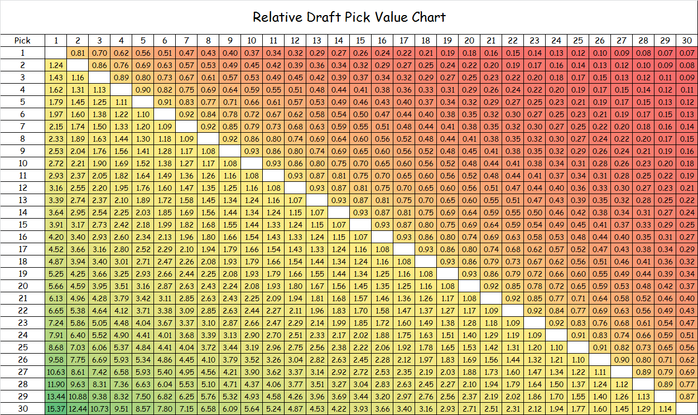
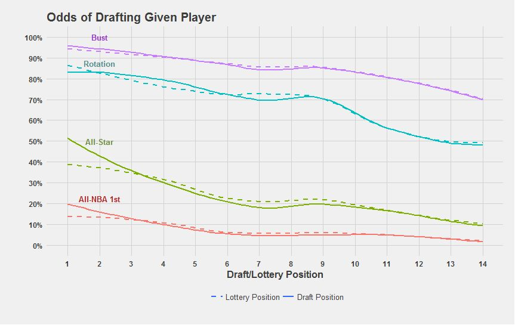
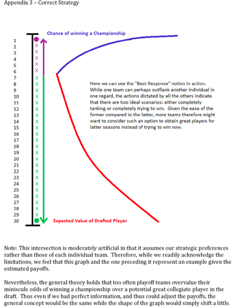

# What Research Says about NBA Draft Pick Value, Part 2

Having asked and answered the biggest question(s) about the value of NBA draft
picks in [my last post][1], there are a couple more questions that I sought to
have answered (and will attempt to answer myself in my upcoming step-by-step
guide to estimating NBA draft pick value.) If you haven't read that post, you
should definitely check it out because I will reference some of the research
discussed there in this post.

## More Questions

### The Third Question

Picking up where I left off, I can articulate two other questions (i.e. "third"
and "fourth" questions) that I sought to answer in my earlier review of existing
research. ^[Actually, to be truthful, I only postulated these questions while 
looking for answers to my previous two questions. The third question can 
be simply stated as __"What is the relative trade value of picks?"__] 

In considering the meaning of "value" as I did before, I think answers 
for this question contextualized in terms of either basketball 
production or monetary cost are equally valid. Some general managers 
might be fascinated with the superstar potential of a particular 
prospect and, consequently, would be willing to give up other assets 
(e.g. experienced players, future picks, etc.) to move up in the draft 
and pick that talented player. On the other hand, some may be more 
concerned with cap considerations or trying to __“beat the 
market”__ by moving into slots that are most __“cost-effective”__. ^[I 
mentioned the term "cost-effective" in my previous post without 
formally defining it. In reality, economics terms such as 
"cost-effective", "beating the market", and "return on investment" 
should be formally defined in an NBA context by the person conducting 
the cost analysis. In any matter, I think that the reader can probably 
correctly infer the author's intended meaning if the author neglects to 
define such terms. Thus, I am interested in trying to come up with the 
answers to the third question from both kinds of “value” 
perspectives---purely basketball production and purely monetary cost. In 
particular, I would say that the monetary interpretation is interesting 
for identifying general managers who have tried to “outsmart” their 
colleagues.]

### The Fourth (and Final) Question 

Finally, the last question that I looked to answer (for now) is __"Can 
tanking be justified?"__ ^[The term "tanking" refers to a team that 
intentionally loses to try to improve its odds of winning the NBA lottery. 
The 14 teams that miss the playoffs are entered into a lottery that 
determines draft order. The teams with the worst records have the best 
chances of winning a higher draft slot. More detail about the lottery can be 
found at the satirical <a href="http://www.tankathon.com/">NBA Tankathon 
website</a>.] 

Even though this fourth question does not explicitly include the word “value”, I
believe that its answer is still dependent upon the word's interpretation. In
this context, it is probably easiest to interpret its answer on the basis of
on-court basketball production, as opposed to off-court monetary cost. In
particular, I think a reasonable analysis of the question might compare the
chances of a team winning the championship against the likelihood of improving
the team with a higher draft pick. In this case, it might be necessary to
evaluate “value” on a relative scale because winning a championship is a
__binary__ variable (i.e win or no win), whereas the unit of measurement is
different for cost (i.e. $ million for rookie contracts) ands for the
researcher's statistic(s) of choice for quantifying basketball production (e.g.
an “all-in-one” metric like __win shares__ (WS)).

As you can see from this caveat-filled discussion (as well as the one in my last
post) the term “value” is fairly ambiguous. Nevertheless, having defined it in a
specific way for each question, I think we can now better contextualize the
answers provided by existing research.

## More Answers

### The Third Answer

My third question is answered directly in [one of the articles][2] I have
already reviewed. [Arturo Galletti][3] translates his regressed "Net Actual
Value" values (which he calls "Modeled Values") to relative ones for the purpose
of constructing a pick trade value chart. This chart is shown below.

After inspecting Galletti's regression formula and his numbers for "Modeled
Value", I found that he simply calculates the quotient of the values for any
given two picks to come up with their relative trade value. However, I think it
is better to use an alternative method that leverages the concept of
[__indifference probability__][4] (IP) to calculate relative trade values (as I
do in [a separate post][5]) where I first scale all the monetary values to a
0-to-1 unit-less basis before taking the quotient of any two values. I believe
that my method for calculating relative values using IPs is superior because it
does not result in __negative__ values for second-round picks. In particular, if
Galletti were to have expanded his chart to include all 60 picks, you would
begin to see negative values for picks 38 and below when their values are
calculated with respect to the top pick.

Anyways, the following figure depicts how Galletti's numbers would look for the
top 10 picks using my proposed alternative method using IPs.

Aside from Galletti, _[Nylon Calculus][6]_ contributor [Nick Restifo][7] 
provides a trade value chart posted in [a recent 2016 article][8] at 
[Fansided][9]. Similar to [Saurabh Rane][10], Restifo uses peak __[value over 
replacement player][11]__ (VORP) values (although he averages over the 
combined best two-year VORP value rather than simply taking the best 
single-season value), and, like [Michael Lopez][12], he runs a LOESS 
regression (although he keeps the raw value of the top pick). Although 
Restifo's chart is __not normalized__ like Galletti's, the value of certain 
picks relative to one another can be interpreted by finding the absolute 
difference between the listed values of the picks of interest. ^[As an aside, 
one should realize that, even if the values of two lower picks is equal to 
that of a single higher one, one might reasonably prefer the higher upside 
presented by the higher draft pick, while someone else might prefer the 
"diversification" of having two prospects as opposed to one.]

Interestingly, after Restifo's __absolute__ VORP numbers are normalized to a
unit-less 0-to-1 basis using the same alternative method that I used to
re-calculate Galletti's numbers, it turns out that his __relative__ trade value
numbers differ relatively dramatically from Galletti's. The following figure
mirrors the same idea shown in the previous figure for Galletti using the
calculated relative values for Restifo.

So whose numbers should be taken as truth? As it often seems to be in analytical
discussion like this, the answer is "it depends" . We must realize that the two
sets of normalized numbers are calculated in a different context---Restifo looks
only at_ __basketball production__, while Galletti __discounts__ on-court value
by rookie wage scale __cost__.

I can make an effort to account for this difference by using Galletti's
regressed "$ Value of Wins" formula estimating the monetary value of wins.
Recognizing that this formula---although it is described in units of
currency---correlates directly with Galletti's basketball production "Avg Wins
per Pick" data set, I can review how Galletti and Restifo stack up on an equal
basis after normalizing these basketball production values with the regression
formula that Galletti provides for his "$alue of Wins [$ million]".

In doing so, I come up with numbers that describe the same idea---basketball
production. Having back-tracked Galletti's numbers to neglect cost, the only
difference in the two basketball production estimates is that Galletti's numbers
are based on [__wins produced__][13] (WP), which is fairly similar to [__win
shares__][14] (WS), while Restifo's are based on peak VORP. The following figure
shows Galletti's trade value estimates for the top 10 picks calculated for his
basketball production metric.

So, even after accounting for Galletti's slightly different method of
calculating relative values, negating the cost factor incorporated into
Galletti's original numbers, and normalizing the Restifo's VORP numbers, it
still appears that Galletti's and Restifo's trade value estimates vary fairly
noticeably. (In fact, it appears that their estimates differ even more now!) As
I implied before, this difference arises purely from each writer's choice of
basketball-production metric.

Thus, despite my efforts to account for differences in methodology between two
researchers, I will leave this discussion at this point. All that is to be said
is that the answer to my third question regarding relative trade value depends
on your evaluation of the merit of a given advanced metric.

### The Fourth (and Final) Answer

Finally, as with my third question, an answer to my fourth question can be found
in one of the articles I have already summarized. Rane leverages his estimates
for draft pick value contextualized by likelihood of player outcome---All-NBA
First-Teamer, All-Star, rotation player, or bust---and normalizes them on a
percentage basis to estimate the expected value for a team __BEFORE__ the
final lottery spots are determined. The dashed and solid lines in his figure
below depict the expected values before and after the teams drafting at each
draft slot are finalized. Thus, by looking at Rane's __"prior"__ and
__"posterior"__ estimates, we can simulate the perspective of a team that is
bound to miss the playoffs and might reasonably tank in order to improve its
lottery odds.

In comparing the two types of lines, Rane notes that tanking when one already
has one of the bottom-three or bottom-four win-loss records is not beneficial,
as is made evident by the flattening of the dashed curves for the All-NBA
First-Teamer and All-Star for the very top draft slots. ^[On the other hand, 
the final expected value of lottery picks between 5 
and 14 generally is equal to (or greater than) before the finalized 
allocation of draft picks to teams.] While Rane does not explicitly 
confirm that the converse is true---that tanking can be beneficial for 
losing teams that are below average but not egregiously bad---he implies 
that tanking is not justified for mid-lottery and low-lottery teams 
either. He notes that the relative indifference in odds of netting an 
__elite__ player (i.e. All-NBA First-Teamer or All-Star) within the 
mid-lottery range of picks suggests that these picks aren't actually as 
valuable as some pundits have suggested, with respect to producing 
superstar players. Rather, the linear rise of the rotation and bust 
lines in the mid-lottery range suggests that higher picks in this range 
only generate good __baseline__ players (i.e. rotation players or busts) 
with increased likelihood. ^[On a related note, these trends 
reaffirm the raw conclusion that we made about the generalized draft 
pick value question---that basketball production drops off as pick 
number increases---and give a partial answer to my restated second 
question from before (__“At which draft slots does the expected 
basketball production outperform the contractual obligation the 
most?”__) Using Rane's illustrations, we can deduce that, in terms of 
pure basketball production, the value of mid-lottery and low-lottery 
picks are highly unlikely to generate elite players. Of course, the 
conclusions of others who have evaluated draft slots in terms of pure 
basketball production also implies the same principle, but Rane's 
illustrations and rhetoric make this notion definitive.]

 Rane's conclusions are backed up by a [_Journal of Sports Economics_ 
study][15] published earlier this year. (This study is concisely 
summarized by renown American writer [Jonah Lehrer][16] on [his 
blog][17].) ^[I am thankful to Lehrer for his review of the study 
because I do not actually have access to the study.] Published under the 
lead of [Akira Motomura][18], the research paper concludes that a team's 
general management and other intangible infrastructural influences (i.e. 
"team culture") has a stronger influence on the success of a team than 
do the draft slot it earns and the players that they draft. In specific, 
Motomura et. al. find that picks 1 through 3 tend to have a relatively 
__neutral__ impact on the near-future win-loss records of their 
respective teams, that picks 4 through 10 actually have a __negative__ 
impact over the following years ^[Motomura et. al. find that these picks 
correlate to 6 to 9 more losses three years after the draft year, and 
that, more generally, all picks in the lottery range (and extending to 
pick 17) are associated with __negative__ (or __negligible__ at best) 
team performance. These numbers clearly suggest that tanking is not 
exactly the best strategy for teams looking to improve.] 

A number of factors can explain the conclusion that tanking lacks merit. For
one, it is understandable that even the most talented rookies cannot make a huge
impact and turn franchises around immediately because they tend to make many
more mistakes than their veteran peers, who can make up for any age-induced
talent diminishment with their experience and knowledge of the game's
ins-and-outs at the professional level. Veterans tend to garner more respect
from referees than younger players, understand the tendencies of opponents after
having played them numerous times, and know how to pace themselves in a manner
such that they don't wear down by end of the regular season. Even after young
players move on from their rookie seasons, they often don't mature and reach
their full potential for another couple of years.

Aside from the experience advantage that discounts the effect of young 
players, there is also the fact that picking players in the draft is an 
inexact science. Teams at the top of the draft often pick players that 
turn out to be busts. Although tanking can increase the probability of 
earning a high draft slot, the __expected__ value of a pick is just 
that---an expectation. There is no guarantee that teams will select the 
best player for them. As Motomura et. al. argue, drafting players and 
player development are skills that derive from the foresight and 
teaching capabilities of the team's management. Thus, a draft pick's 
expected value is heavily influenced by the team that is selecting at 
that slot, which is not reflected in any publicly available draft pick 
value model of which I am aware. ^[Accounting for how team factors 
correlate with the value extracted from draft picks would be a very 
difficult task that would require lots of probabilistic assumptions.] 

While the research of Rane and Motomura et. al. suggest that tanking is not
justified, [Arturo Gutierrez][19] finds in his research article _The NBA Lottery
and Game Theory_ that there are cases that tanking can be the __"correct
strategy"__. For his analysis, Gutierrez first formulates an estimate of draft
pick value by running a polynomial regression over the career WS earned by
players drafted by teams ordered by win-loss record. ^[In contrast to the 
methods used by the researchers I discussed in my last post, he does not 
directly relate his choice of basketball production metric (in this 
case, WS) with draft slot; instead, he factors in the probabilistic 
relationship of lottery odds with team win loss-record to relate 
basketball production to teams ranked by record. Also, he uses a 
polynomial regression rather than a linear-log regression or a LOESS.] 
Then, he formulates an estimate for the likelihood of a team winning the 
championship by running a separate regression over the historical 
results of teams ranked by playoff seed, Next, he compares these 
regressed curves on a graph over a dependent axis with numbers counting 
from 1 to 30 in order to represent teams ordered by best win-loss record 
for any arbitrary season. Finally, after accounting for what he calls 
the __"time value"__ of winning a championship (such that the values 
of his regressed curve for championship likelihood are boosted because 
chances of winning in the near future are added to the single-year 
values), Gutierrez outputs a graph that indicates that any team worse 
than the sixth-best team should purposely try to lose. ^[Without accounting for "time 
value", then the intersection point manifests at the third-best team. 
This graph is shown in the figure below.]

I think that Gutierrez's perspective on this matter suffers somewhat 
from its failure to consider [__mixed strategies__][20] and their 
equilibria. He considers only the [__pure strategies__][21] 
of expending all effort to be the best team or to be the worst team. 
^[This perspective is like a manifestation of the idea that I described 
at the beginning of this post---evaluate tanking by comparing draft pick 
value and championship likelihood from a stict binary point of view.] 
Nevertheless, Gutierrez admits that there are limitations to his 
approach. He notes that the __"[best response][22]"__ for a given team 
is dependent on its specific situation, including variable such as the 
team's win-loss record and its perception of whether or not other teams 
are tanking. Thus, even though Gutierrez's analysis offers some validity 
to tanking, I don't think his evidence is sufficiently strong to 
override the case made by the research of Rane and Motomura et. al. 

### Final Thoughts 

In my [last post][1] I vowed to take a look at the value of draft picks 
in terms of basketball production and contractual costs after reviewing 
the methodologies and conclusions of other researchers. There, I found 
that the answers were fairly the same across all researchers. Moreover, 
I reviewed only one person ([Aaron Barzilai][23]) who really evaluated 
the cost-effectiveness of picks, a topic which I also plan to explore. 

Now, having reviewed what research has to say about the related topics 
of pick trade value and tanking and having coming to some non-universal 
answers, I plan to expand my investigation to include these subjects as 
well. 

[2]: http://wagesofwins.com/2013/05/21/from-the-vault-the-value-of-a-draft-pick-and-draft-pedigree-in-the-finals/
[3]: https://twitter.com/ArturoGalletti
[4]: https://en.wikipedia.org/wiki/Principle_of_indifference
[6]: http://nyloncalculus.com/
[7]: https://twitter.com/nickrestifo
[8]: https://fansided.com/2016/06/16/nba-draft-trade-value-chart/
[9]: https://fansided.com/
[10]: http://nyloncalculus.com/2016/06/17/freelance-friday-expected-value-in-the-nba-draft/
[11]: https://en.wikipedia.org/wiki/Value_over_replacement_player
[12]: https://statsbylopez.com/2016/06/22/the-making-and-comparison-of-draft-curves/
[13]: http://wagesofwins.com/wins-produced/
[14]: http://www.basketball-reference.com/about/ws.html
[15]: http://jse.sagepub.com/content/early/2016/03/30/1527002516641169.abstract
[16]: https://twitter.com/jonahlehrer
[17]: http://www.jonahlehrer.com/blog/2016/4/25/is-tanking-an-effective-strategy-in-the-nba
[18]: http://www.stonehill.edu/directory/akira-motomura/
[19]: https://twitter.com/Art_Gutierrez
[20]: http://www.gametheory.net/dictionary/MixedStrategy.html
[21]: https://en.wikipedia.org/wiki/Strategy_(game_theory)#Pure_and_mixed_strategies
[22]: https://en.wikipedia.org/wiki/Best_response
[23]: https://twitter.com/basketballvalue
