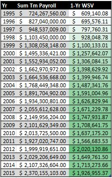
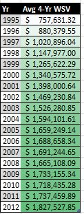
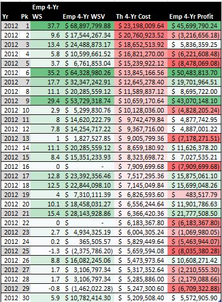
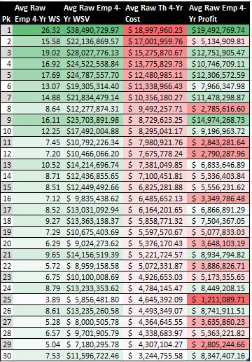
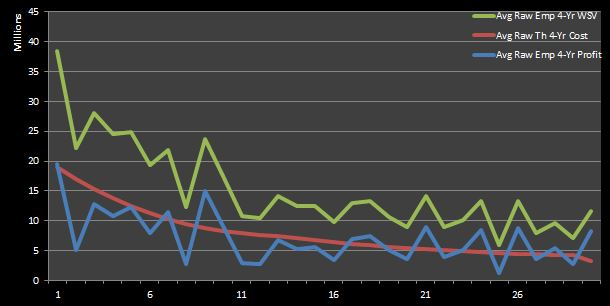
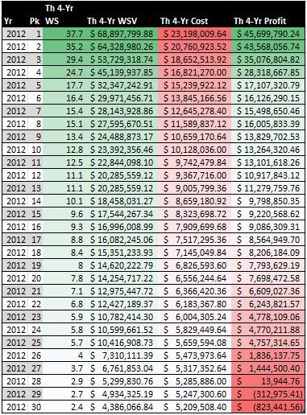
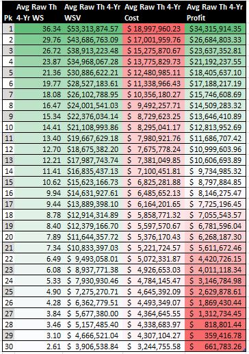

# Estimating the Value of NBA Draft Picks

In this chapter I present my attempt to estimate the value of NBA 
draft picks. ^[Microsoft Excel is my software tool 
that I use here. [R](https://www.r-project.org/) and
[python](https://www.python.org) are wonderful alternatives with 
which I have gained experience recently, but, for now, I am most comfortable 
with Excel, especially when it comes to plotting and formatting.] 
Given that countless other articles 
and research papers have already been conducted on this topic or something 
related to it, you may be wondering why I'm interested in covering a 
subject that many others have already carefully analyzed.

The answer is multifaceted. First, I've been 
a huge sports fan ever since I was a little kid, as I mentioned in a previous chapter
about the origins of this website,. In particular, basketball is my favorite 
sport to play casually, and the NBA is probably my favorite professional 
league to follow. ^[Of 
course, you could probably guess that my favorite is the Spurs. Nevertheless, 
the beauty of the NBA is that it's play is defined more so by great 
individual players than by teams themselves, so great players make their 
teams entertaining to watch. Thus, I think I can say that I enjoy watching 
any team on any given night. Moreover, I'm not a Spurs "fanatic"  in the 
traditional sense of the word. As a wannabe analyst, I try to be as neutral 
as possible when observing teams.] Second, since near the end of my 
time in college, I've learned a 
lot of the basics of topics such as __game theory__ through online 
[Massive Online Open Courses](https://www.mooc-list.com/) 
(MOOCs) and some other less formal 
mediums. I was hungry to find a topic to which I could apply some of my 
new-found knowledge in a meaningful way. Third, despite the other research 
discussing the value of NBA picks, I still feel like this subject matter can 
be explored in more ways. Thus, being a huge fan of the NBA and realizing 
that the NBA draft can be analyzed from a variety of perspectives based upon 
the knowledge I have gathered from the things I have recently studied, the 
value NBA draft picks turned out to be an easy choice of topic to 
analyze.

So why should you even read this if others 
have already written about in depth? First of all, I make references to
__[economic theory](https://en.wikipedia.org/wiki/Economics#Theory)__ 
and disciplines related to __decision analysis__ when explaining terms.
Secondly, and more importantly, I try to be 
as explicit as possible so that anyone can follow my methodology and adapt it 
to their liking if they want to investigate the matter themselves. I should 
note that, because it would have been foolish to have completely ignored all 
of the wonderful other research out there, some of my design choices may seem very 
similar to that of others. However, I assure you that I do my best to make my 
methodology unique where I think it is reasonable to differentiate from the 
example set by others. Also, as you can probably tell from my last two posts, 
my perspective on what__ "value"__ means is somewhat nuanced and 
different from others' interpretation, so my answers to questions related to 
draft pick value in the NBA may, consequently, differ. 

## Which Drafts?

To begin, I need to choose which and how many 
drafts from which to draw data. I will settle on using data from the 18 
drafts between 1995 and 2012. I reasoned that this data set defines a 
historical sample size that is significant enough for me to draw reasonable 
conclusions. ^[All draft data was extracted from [Basketball Reference](http://www.basketball-reference.com).]
Although I certainly could have used 
more data to improve the empirical accuracy of my calculations, I did not 
want to spend a large amount of time in doing so because I believe there is 
significantly more to be gained in learning how analysis techniques might be 
applied in this context. Also, I do not necessarily enjoy data mining and 
munging, and I didn’t want to take any extra time to write some scripts to 
retrieve and format the extra data, although I am certainly capable of doing 
so. In reality, I simply downloaded comma separated value (csv) files and 
formatted the data to my liking in Excel. In particular, I chose the 
1995 draft as the first one my sample because 1995 was the first year that a 
__rookie wage scale__ for first-round draft picks was instituted, which 
makes it possible to model the expected rookie contracts for those drafted in 
the top 30 (without having to look up the actual contracts handed out for 
each player individually). I chose the 2012 draft as the last one in my 
sample because rookies from the 2012 draft have had the opportunity to play 
__four seasons__, which is the typical length of the contracts 
given to those drafted in the first round.

## The Rookie Wage Scale

A brief overview of how the [Collective Bargaining Agreement](http://nbpa.com/cba/) CBA) 
structures the rookie contracts of first-round picks should be made. 
According to the CBA, NBA teams have full rights to their first-round pick 
for five years. ^[An 
overview of the 2011 CBA provided by salary cap guru [Larry Coon](https://twitter.com/LarryCoon)
can be found [here](http://www.cbafaq.com/salarycap.htm).]
The CBA specifies the salary number that teams pay 
a player drafted at a given slot in the first round. For 
example, the rookie scale for the 2012 draft class can be seen 
[here](http://basketball.realgm.com/nba/info/rookie_scale/2012). 
 Although teams can sign their 
players to any number within an 80% to 120% range of the slot’s specific 
compensation obligations, the two sides almost always agree to the 
__maximum__ allowable salary number (i.e. 120% of the nominal value) in 
practice. Teams are obligated to pay their first-round picks for the first 
two seasons, and then have options to resign them for their third and fourth 
years,. It should be noted that the teams have to decide whether to pick up 
these options before the players’ second and third years respectively. Then, 
after the picks have played four seasons, the team has the option to make a 
qualifying offer to the player for a fifth year, still abiding by the salary 
limitations imposed by the CBA. In reality, most first-round draft picks that 
do well in their __first four seasons__ sign a new contract (without the 
salary restrictions dictated by the CBA) in restricted free agency after 
their fourth year in the league. (The player’s team has the right to match 
any contract to the player by another team, which is the reason for the 
“restricted” descriptor.) ^[Consequently, the revenue earned by 
top 30 picks becomes highly variable after the fourth year of their rookie 
deals. It would be difficult to track post-rookie contract numbers for the 
purpose of the project. Similarly, it is difficult to verify that the 
contracts of top 30 picks follow the general contract template having 
four-year length with 120% of nominal compensation. These two issues could be 
addressed by some nifty web scraping scripts. However, as I mentioned before, 
I wasn't analysis.]

There are certainly exceptions to the general 
rule-of-thumb of first-round draft picks playing four seasons under a rookie 
contract. Top 30 rookies who do not play well may be released and never play 
more than two or three seasons under their original contract. However, it is 
very uncommon for teams to neglect the draft pick’s third-year option because 
they will have only had one season to evaluate the prospect at the time that 
they must make this decision. Presumptively, a first-draft pick demonstrates 
a sufficient amount of potential to persuade their team from deciding after 
only one year that they no longer want to keep the player on their roster. 
^[[Joe Alexander](https://en.wikipedia.org/wiki/Joe_Alexander_(basketball))
sounds more like an accountant’s name than a high-flying potential 
lottery pick, am I right?] For similar reasons, it is uncommon for 
teams to neglect to pick up the player’s fourth-year option, although this 
scenario has a slightly greater chance of occurring because teams will have 
had two seasons to evaluate their prospects at the time of the decision.^[In 
retrospect, picking [Jonny Flynn](https://en.wikipedia.org/wiki/Jonny_Flynn) over Stephen 
Curry may not have been the most astute of decisions.] More rarely, 
there have been some first-round picks that take the fifth year qualifying 
option in order to become an unrestricted free agent in the following 
offseason and have the ability to sign with any team that they choose, 
perhaps because they have not enjoyed their time with their original team. 
^[Unfortunately for him, [Greg Monroe](https://en.wikipedia.org/wiki/Greg_Monroe)’s 
decision to sign with the Milwaukee Bucks doesn’t look like it has turned out so great.]

As a technical note, I should let you know 
that there were only 29 NBA teams from 1995 to 2006 before a 30th franchise 
was added to the league. Consequently, there were only 29 picks in the first 
round before 2007, and only 58 total picks in the draft. Also, some drafts 
had one team that had to give up rights to a pick in these years due to 
violations, so some drafts only had 57 picks. However, the rookie wage scale 
has always accounted for the top 30 picks, dating back to 1995. Thus, some of 
the upcoming cost, value, and profit numbers are skewed because I don’t 
attempt to account for these nuances.

## Calculating Cost

Before discussing my method of dealing with player salaries, I have to give 
major props to [Nate Silver](https://twitter.com/NateSilver538), who makes an attempt to account for the 
exceptions that I have described (about the rule-of-thumb template for 
first-round rookie contracts) in
[his take](http://fivethirtyeight.com/features/how-much-is-winning-the-nba-draft-lottery-really-worth/) on the value of NBA draft 
picks. This means that his results might be a bit more accurate than mine. 
(But hey, I’m not quite the number-crunching machine that Silver is, so don’t 
hold me to his standard!) [Arturo Galletti](https://twitter.com/ArturoGallett) doesn’t provide much detail 
about how he deals with this topic in his research but I think it’s safe 
to assume that he does something similar to what I have done here. Anyways, 
you can read more about the methodologies and results of Silver, Galletti, 
and others in another chapter I made on existing research concerning this 
general topic of NBA draft pick value.

Now, for my analysis, I make the simplifying 
assumption that all top 30 picks receive the basic four-year, 120%-baseline 
rookie contract. As an example, the numbers for the 2012 first-round picks 
can be seen in Figure 1.

Figure 1: Four-Year Cost of 2012 First-Round Draft Picks

In the context of __[economic theory](https://en.wikipedia.org/wiki/Economics#Theory)__, 
we can think of these salaries as the costs for 
draft picks, which can be interpreted as
__[assets](http://www.investopedia.com/terms/a/asset.asp)__. Moreover, in a
__[game theory](http://www.gametheory.net/dictionary/Game_theory_history.html)__
context, this cost is like a [__discount factor__](https://www.youtube.com/watch?v=-Lhafc-feQc) applied to a 
__[payoff](http://www.gametheory.net/dictionary/Payoff.html)__ in a 30-player, 
__[iterated](http://www.gametheory.net/dictionary/IteratedGame.html)__
__[non-zero sum game](http://www.gametheory.net/dictionary/ZeroSum.html)__.
The game is the draft, where the players are the 
teams, and the payoffs are the value earned from draft picks. (I will discuss 
this notion of “value” in detail in the next section.) In this case, I am 
applying a discount factor unique to each to draft slot instead of scaling 
payoffs on a multiplicative basis, as is done traditionally in games.

Before moving on, let me take a  quick pit 
stop and highlight an important caveat. Notice that I have only discussed 
first-round draft picks thus far. This is because the CBA does __NOT__ 
determine how teams must pay their second round picks. This makes it 
difficult to model the value of second-round picks without rigorously 
scraping the web for details of their contracts, which aren’t always publicly 
available anyways. For this reason, my analysis in this chapter focuses only on 
top 30 picks. (Nevertheless, I plan to make an attempt to model the value of 
second-round picks in the future in order to investigate the relative 
__trade value__ of picks.)

## Defining Value

With the question about how to quantify a 
player’s cost out of the way, now there is the question of how to measure a 
player’s value in terms of __basketball production__. From an 
economics perspective, this basketball value can be interpreted as the 
__[returns](http://www.investopedia.com/terms/r/return.asp?o=40186&l=dir&qsrc=999&qo=investopediaSiteSearch)__ of an asset. 
However, because the term “value” is more intuitive in this context, I will 
use it instead of “returns” (although I may still use “returns” every so 
often).

While determining cost by contract numbers is 
probably not very controversial, there is certainly some debate as to how 
determine the value of an individual player in the context of team sport. 
Should I use a conventional box score statistic like points? (Definitely not. 
This is way too naive.) Perhaps some combination of these kinds of stats? 
(This is a better idea than simply using one statistics, but it could still 
be better.) My answer is along that train of thought.

My choice is to use an “all-in-one” metric 
called __[win shares](http://www.basketball-reference.com/about/ws.html)__ (WS), 
which  attempts to determine what its name implies---the value of an 
individual player in terms of team wins. WS has been used for years among 
analytical circles to measure the value of players, along with other 
all-in-one metrics such as __[player efficiency rating](https://en.wikipedia.org/wiki/Player_efficiency_rating)__ (PER) and 
__[value over replacement player](https://en.wikipedia.org/wiki/Value_over_replacement_player)__ (VORP). 
As proof of validity, 
several of the researchers that I discussed in a 
prior chapter use WS in their draft pick value models.

Why choose WS over other all-in-one metrics? 
Without going into all the mundane details of how it is calculated or deep 
theoretical arguments about why it is the best all-in-one metric, the primary 
reason for this choice is simple---WS is contextualized on a seasonal basis, 
which lends itself to my analysis. On the other hand, most other advanced 
statistics are calculated per minute or per possession rate like most other 
advanced statistics. Instead, it. (I should note that there are methods for 
converting PER to a seasonal rate, but PER is typically not used in such a 
manner.) Also, WS can be easily found on many websites such as 
[Basketball Reference](http://www.basketball-reference.com/), and using it prevents me from having to calculate 
my own metric. represented by WS with the cost represented by the player’s 
contract. In fact, [Basketball Reference](http://www.basketball-reference.com/)’s 
querying tool makes it relatively simple for me to find the four-year WS sums 
of players drafted in a given year. ^[If 
you’re wondering why I use four-year sums instead of the WS for individual 
seasons, it is because it requires much more work to do so. Using 
[Basketball Reference](http://www.basketball-reference.com/)
as a resource, I would have to extract 
annual WS values for each player from each of their individual career stats 
pages. I’m not sure if there is a better or easier way of doing this other 
than writing a script to scrape all the data. In retrospect, I certainly 
could have written these kinds of scripts fairly easy, but I did not think of 
it at the time of starting all of my analysis. This would have also allowed 
me to get exact data regarding contracts. Nevertheless, having exact contract 
information regarding first-round rookies is arguably not necessary because 
general managers probably expect that the typical application of the rookie 
wage scale, so I don’t think it’s a good idea to try to account for 
exceptions to the general rule-of-thumb---such as major busts or very early 
retirement---in our models. On the other hand, the empirical salary data for 
second-round picks would be extremely helpful for evaluating the cost and 
value of second-round picks without having to make huge assumptions. It would 
allow me to expand my look at the draft in a manner such that the relative 
desirability of first-round picks would be better encapsulated because the 
last pick in the first round would not have to serve as a “baseline” 
measurement.]

Anyways, I don’t think the integrity of the 
my analysis is compromised significantly, if at all, because I use four-year 
sums and averages consistently. Also, taking sums and averages is arguably 
more representative of how general managers set their expectations for 
rookies. Most general managers are probably not judging rookies on how they 
can immediately impact their teams in the first year or so after being 
drafted; instead, they are most likely evaluating prospects on the potential 
value and profit to be had over the course of a many years, even going beyond 
the first rookie contract. Alas, perhaps in the future I may take a more 
discrete look at cost, value, and profit for each of the four years following 
a draft and compare them to my current analysis, but I do not think it would 
cause me to come to significantly different conclusions.)

Although I said I wasn’t going to go into 
detail about why WS might be the best all-in-one metric, I feel obliged to 
mention the biggest disadvantages of its most legitimate alternatives---PER 
and VORP. (I’m sorry to those fans of
__[plus-minus](http://nyloncalculus.com/2014/09/25/glossary-plus-minus-adjusted-plus-minus/)__, but there are 
just so many version of Plus-Minus---including as
[box plus-minus](http://www.basketball-reference.com/about/bpm.html) (BPM), 
[adjusted plus-minus](http://www.basketball-reference.com/about/bpm.html) (APM), and 
[regularized adjusted plus-minus](http://www.nbastuffer.com/component/option,com_glossary/Itemid,0/catid,42/func,view/term,Regularized%20Adjusted%20Plus%20Minus%20(RAPM)/) 
(RAPM)--that I don’t even consider it here.) PER can be skewed 
significantly by small minute sample sizes, and it arguably does not capture 
the value defensive play very well. Although VORP is arguably the most 
predictive all-in-one statistic, it also suffers from the difficulty of being 
translated to a seasonal rate. ^[Having lightly criticized PER and 
VORP, I must admit that one downside of WS is that players on good teams tend 
to have over-inflated WS because those teams win more often and, 
figuratively, have more wins to attribute to its players. Nevertheless, 
because the highest-picked, more talented rookies tend to be picked by worse 
teams, this WS bias is not too troublesome for this analysis. If anything, 
this bias causes the results to be regularized because the potentially 
grandiose and miniscule effects of higher and lower picks respectively may be 
offset by the talent of their teams.]

In relation to __[utility theory](http://www.businessdictionary.com/definition/utility-theory.html)__,
one could argue that the metric used 
to represent basketball value---in this case, WS---represents a player’s 
[utility](http://www.gametheory.net/dictionary/Utility.html). (In relation to game theory, which incorporates 
the principles of utility theory, WS would represent a payoff, 
as mentioned before.) From a purely basketball perspective, this make sense. 
However, the reality is that the NBA is a business and players are not only 
valued by the quality of their play, but also the desirability of their 
contracts. Put another way, given two players who contribute equally on the 
court (and are equal in terms of other factors such as risk of injury, 
personality, etc.), general managers would choose the one with a cheaper 
contract. Thus, I do not think that we can simply judge a player’s utility by 
their WS (or some other all-in-one metric). Instead, we must discount the 
value. 

So how do I translate WS to a currency? My 
answer here is not as straightforward as my choice of WS is, but it isn’t too 
difficult either. I can simply (1) sum up team payroll data ^[credit to 
Patricia Bender for 
collecting the data at [her website](https://www.eskimo.com/~pbender/)]
for a given year ^[for 
example, the team payrolls for 2012 can be seen [here](https://www.eskimo.com/~pbender/misc/salaries13.txt and (2) 
divide this 
number by the number of games played in the regular season ^[1230 for a 
typical 82-game season 
with 32 teams, 1189 for seasons before the 2007 expansion when there were 
only 29 teams, 725 for the lockout-shortened 1999 season, and 990 for the 
lockout-shortened 2011 season]. The result is an approximation for what I 
call __“WS value”__ 
(WSV). ^[I 
could be more granular here by dividing each team's win total in a given 
season by its team payroll for that season to get a team-specific WSV for 
each season. However, I don't think the results would differ 
noticeably.] I did this for each of the 21 seasons from 1995 to 2015. 
^[Galletti uses a similar method for 
translating WP to a monetary value, and Silver uses the figure $1.75 million 
for his calculations.] The results are shown in Figure 2.

Figure 2: Single-Season WSVs for 1995 --- 2015

Next, I simply averaged the three seasons’ 
WSs with a given starting season from the five years for which I am 
interested (i.e. 1995 to 2012). As a result, I came up with a average 
four-year WSV for each season from 1995 to 2012, which can be seen in Figure 
3.

Figure 3: Average Four-Year WSVs for 1995 --- 2015

## Profit: Value - Cost

Using these WSV averaged over four years, I 
can calculate the WSV for the top 30 picks for each of the 18 drafts by 
multiplying their number of WS by the appropriate average four-year WSV. As a 
technical note, I refer to these values as __“empirical”__ in order to 
differentiate them with my upcoming regressed and __“theoretical”__ 
analysis. ^[I 
always use the descriptor “theoretical” for cost even with my analysis of 
empirical WS because I do not use actual contract numbers. Instead, I use the 
projected cost numbers outlined by the rookie wage scale and its general 
application, as discussed before.] Similarly, I say __“raw”__ to distinguish 
between averaged results 
that are calculated using __“regressed”__ values.

After coming up with a number for the returns 
(i.e. the basketball production in terms of WS) of the asset (i.e. the draft 
slot), I can determine the empirical 
“____profit____” of each draft pick by taking the difference of the 
empirical four-year WSV and the draft slot’s four-year cost. Here, the term 
“profit” is used just as it would be in an economic context. ^[As 
a reminder, I am using the everyday term “value” in my writing, or the 
basketball metric WSV in my analysis, to represent the economic concept 
“returns”. On the other hand, my use of “cost” aligns with its intuitive and 
economic meanings. With respect to the term "profit" In the context of 
utility or game theory, one might say that it can also be interpreted as a 
“utility”. However, to be consistent with the economic context that I have 
applied up to this point, I will use primarily use the term “profit”. Also, I 
just think it is more distinctive than the term “utility”.] Anyways, 
(for those you who couldn’t care less about terminology) the un-averaged, 
single-season profits for each first-round draft slot in 2012 can be seen in 
Figure 4.

Figure 4: Emperical Four-Year Profit of 2012 First-Round Draft Picks

Figure 5 displays the average results from 
the five drafts from 1995 to 2012 in tabular form. Figure 6 shows the same 
data in the form of a chart. Having mentioned them before, I should note 
that Silver and Galletti come up with 
similar graphs. Also, Galletti has a chart similar to my Figure 5.

Figure 5: Average Raw Empirical Four-Year Profit of 1995 --- 2012 First-Round Draft Picks

Figure 6: Average Raw Empirical Four-Year Profit of 1995 --- 2012 First-Round Draft Picks

Before drawing any conclusions, I must admit 
that the results of the calculations made so far appear a bit noisy. This is 
due to the relatively small sample size. That’s no problem! __Regression__ is 
a real savior in situations like this. Figure 7 shows the results of a 
__[linear-log regression](http://www.kenbenoit.net/courses/ME104/logmodels2.pdf)__ 
run on the average raw data. ^[Here, the “Rd-1” descriptor is to 
added note that the regression is run only on first-round data.(As I hinted 
to before, I hope to analyze second-round data by making specific assumptions 
when modeling second-round rookie contracts in the future.] If you read 
a prior chapter discussing existing research on the topic of NBA draft pick value, 
you should remember that
Kubatko and that Galletti used the same exact type of regression in their
[2009](http://www.basketball-reference.com/blog/?p=2740) and
[2013](http://wagesofwins.com/2013/05/21/from-the-vault-the-value-of-a-draft-pick-and-draft-pedigree-in-the-finals/)posts respectively.

 

Figure 7: Average Regressed Empirical Four-Year

The regression readily confirms what is 
implied by the raw data. That is, it is clear that higher draft picks result 
in greater value for the team, even after accounting for contracts. Thus, I 
have provided an answer to the "first" question (__“How valuable 
are NBA draft picks?"__)__ __that I posed in the 
already-mentioned prior post chapter.

You might be wondering exactly how my regressions look. I have stated the 
empirical WS, WSV, and profit below.

1. Avg Reg Emp 4-Yr Rd-1 WS [WS] = -5.41 * ln(pick) + 23.78
2. Avg Reg Emp 4-Yr Rd-1 WSV [$ million]: -7.729 * ln(pick) + 34.265
3. Avg Reg Emp 4-Yr Rd-1 Profit [$ million]: -2.990 * ln(pick) + 14.546

Although the WS line is not depicted in Figure 7, I show its equation here so 
that it may be compared to the Kubatko's regression formula. Moreover, my WSV 
and profit equations can be compared directly to Galletti's analogues.

1. Kubatko's EV [WS]: -6.3 * log(pick) + 26.5
2. Galletti's Value of Wins [$ million]: -13.79 * ln(pick) + 52.785
3. Galletti's Net Actual Value [$ million]: -8.991 * ln(pick) + 32.705

Although Kubatko'sequation resembles mine fairly closely, there seems to be a 
noticable difference between mine and Galletti's. Nevertheless, do not let 
the numbers fool you! I can assure you that when each equation is graphed along with 
its equivalent, the curves practically overlap. ^[I 
might add those graphs here at a later time as proof, but I have chosen not 
to do so for now.] In fact, if you use the concept of 
__[indifference probability](https://en.wikipedia.org/wiki/Principle_of_indifference)__ (as I do in another chapter) to normalize the regressed 
values on a 0 to 1 unit-less basis, you will find that the calculated values 
are __exactly equal__!

Stepping back from these technicalities, I 
should note that the non-linear, decaying behavior of the value and profit 
lines confirm the common knowledge that the best NBA players largely dictate 
the performance of their teams, regardless of their teammates. This is reason 
why many fans classify players as either instrumental “super-stars”, 
satisfactory “starters”, or plain-ol’ “role players”.) More often than not, 
higher drafts picks turn out to be better players and provide value that is 
not linearly related to the value of a lesser player.

At this point, I have estimates for the 
average empirical four-year cost, value, and profit of players picked in the 
first round of the five drafts from 1995 to 2012 using the WS metric as my 
basis. (I also have regressed versions of empirical WS, WSV, cost, and 
profit, but they are not shown here.) I have shown that all first-round draft 
picks represent __bargains__ in the sense that their basketball production 
contextualized in terms of currency exceeds their monetary cost, as 
determined by the salary obligations for the draft slots. Also, I have 
shown that the top picks are the __most profitable__.

I know what you’re thinking: “That’s nothing new. Others have done that 
before.” Alright, you have a point. But here is where I start doing things 
differently. ^[As 
a note to the reader, given how much stuff I have covered so far, this might 
seem like a natural breaking point at which to end this part of the analysis 
and continue in a separate part. However, because the “theoretical” analysis 
so closely follows the empirical analysis done up to this point, I have 
chosen not to do so.]

## A Different Kind of Profit

What if teams drafted ideally? That is, what 
if they picked the first team picked the best available rookie (in terms of 
WS), the next team selected the second-best rookie, etc.? If I re-order draft 
picks from a given year by WS instead of draft pick and make the same 
assumptions about contracts, how would that look? Figures 8 to 10 are 
analogues to Figures 4, 5, and 7 for this new “theoretical” 
analysis. ^[As 
a technical note, in this analysis I looked at all drafted players for a 
given year and simply sorted them by descending WS. I did not consider 
un-drafted players.]

 

Figure 8: Theoretical Four-Year Profit of 2012 First-Round Draft Picks

 

Figure 9: Average Raw Theoretical Four-Year Profit of 1995 --- 2012 First-Round Draft Picks

 

Figure 10: Average Raw Theoretical Four-Year Profit of 1995 --- 2012 First-Round Draft Picks

Obviously the integrity of the original WS 
data is somewhat compromised if players are re-ordered by WS. Players would 
have certainly performed differently if they had been drafted by different 
teams, meaning that they would have played with different coaches and 
teammates. However, modeling these changes would be fairly difficult. 
Anyways, I think the results that that I have found would not be much 
different from what we would observe if draft picks were made in an ideal 
manner.

So what does theoretical profit mean in a 
non-basketball context? From the perspective of the disciplines such as 
economic or game theory, one can interpret it as the result of every team 
having __[perfect information](https://en.wikipedia.org/wiki/Perfect_information)__.
Conversely, we might say that empirical profit represents the results 
of every team not having perfect information available to them.

## The End (for Now)

For now, I will leave the subject of NBA 
draft pick value here. I did a lot here---I have calculated estimates for the 
average raw and regressed empirical and theoretical WS, cost, value, and 
profit of NBA players drafted from 1995 to 2012. In doing so, I have 
essentially provided my own answer to my "first" big-picture question about 
the value of NBA draft picks. (Because I will never tire from linking the 
reader to my other relevant content, I oblige you to read my 
post discussing answers to my "first" and "second" questions provided by 
other researchers, as well as my
follow-up post discussing peer answers to my "third" and "fourth" 
questions.)

However, there is still so much more analysis 
that can be done, including some that can refine what I discussed here. 
Anyways, I plan to use the data sets developed in this chapter a basis for more 
analysis.

