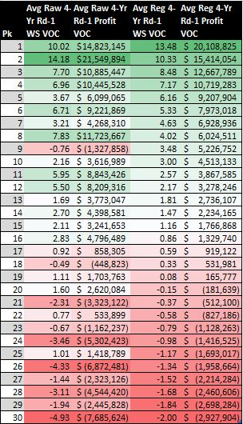
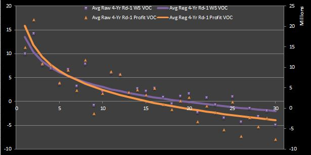
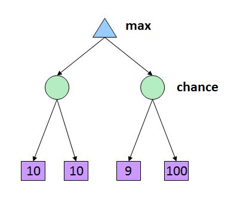

# The Value of Perfect Information and the NBA Draft

In this chapter I will take a look at the
__[value of perfect information](https://en.wikipedia.org/wiki/Expected_value_of_perfect_information)__
(VOPI) in the context of the NBA draft, using some of the data that I derived in
my previous chapter in which I estimated the value of NBA draft picks. I begin
with an isolated overview of some relevant decision analysis terms before
discussing how they can be applied to better understand the NBA draft.

## Some Theory

VOPI, or __value of clairvoyance__ (VOC), is a decision-maker's 
indifferent buying price of perfect information. ^[A word about 
notation---even though VOPI is more commonly used, I like the 
word "clairvoyance", so I tend to use VOC in place of VOPI. Moreover, 
you might find that VOPI is sometimes abbreviated as VPI or referred to 
as __expected__ value of perfect information (EVPI) instead. Also, in 
cases where imperfect information cannot be defined or is not 
considered, VOPI might be restated as value of information (VOI). 
Anyways, all of these terms and abbreviations refer to the same concept. 
A related principle (that must be defined for the purpose of this 
conversation) in the field of
__[decision analysis](http://www.prioritysystem.com/glossary1a.html#decisionanalysis)__ (DA) are 
__[certain equivalent](http://www.prioritysystem.com/glossary1aa.html#ce)__ (CE) and the 
__[delta principle](http://www.prioritysystem.com/glossary1aa.html#d)__.] 

The CE of an option is the quantity (typically stated as a monetary value) that
a decision-maker can be guaranteed and feel __indifferent__ between receiving
this quantity or choosing its alternative with some uncertainty of receiving its
quantifiable return value. Put another way, given three options, a CE is the
quantity that would make the decision-maker indifferent to receiving the
middling option (i.e the option with a level of preference between that of the
other two options) for certain or entering a dual-outcome game of chance in
which there is some well-defined probability between 0 and 1---known as
__[indifference probability](https://en.wikipedia.org/wiki/Principle_of_indifference)__
(IP)--of receiving the more preferable option
and its payoff, and the remaining probability of the less preferable option and
the quantity associated with it. 
^[I plan to investigate IPs and their application more in a future write-up.]

Having defined CE, we can now define the delta principle. We say that a
decision-maker abides by the delta principle if his CE is independent of his
existing wealth. To better understand the delta principle, we should try to
contextualize the relationship---CE independent of wealth---that needs to be
made for the principle to be true. For example, a very poor person---having very
little to lose in the first place---is probably willing to give up a lot for a
very small chance at earning a little. Consequently, we can say that the delta
principle does not apply to poor people. ^[A similar argument can be made for very rich people.]

Looking at the delta principle in another way, we can say that a
decision-maker follows the delta principle if his buying and selling prices for
any given lottery are equivalent. Anyways, no matter the manner one chooses to
understand these ideas, the primary implication of the delta principle (in
conjunction with CE and IP) is that a decision-maker's 
__[utility function](http://www.prioritysystem.com/glossary2c.html#utility)__
can be modeled as a __linear or exponential.__ Without going 
into detail about utility function, suffice it to say that this result is extremely important 
for simplifying calculations involving risk and decisions.

Returning to the discussion of VOC, if we make the assumption that a
decision-maker follows the delta principle, then we can also define VOC as the
difference __WITH__ free perfect information and the value __WITHOUT__ free
perfect information. In this definition you should be careful to observe that,
even though the possession of information is negated when going from the first
to second statement, the object of possession---perfect information---is assumed
to be free in __BOTH__ cases. Thus, we should note that VOC is not just the
difference of the values with and without perfect information; instead, it is
the value difference with and without __FREE__ perfect information.

## Contextualizing VOC

If you recall, time I concluded my guide to estimating NBA draft pick value
with regressed curves for the average four-year empirical and theoretical
profits for first-round picks in the NBA draft using WS and rookie wage scale
data from 1995 to 2012. So how can we incorporate the concept of VOC to provide
a unique perspective on this information?

If I take the mathematical difference of the regressed theoretical and
empirical profit data sets, I can find the VOC for each top 30 draft pick in
terms of win shares (WS), win shares values (WSV), and profit. (Note that the
VOC of cost cannot be found without having the “empirical” cost of each player.)
One should interpret the theoretical curve as the profit of each draft slot if
all teams have perfect information available to them and pick the best possible
player. By "best possible player" I mean the remaining player with the highest
number of actual WS earned after four years of those players not already
selected at a given point in a hypothetical draft where teams drafty ideally.
^[This is just a different way of describing my "theoretical" values.]

Figures 1 and 2 show VOC in tabular and graphical form for the
WS and profits points calculated after regressing over only the first-round
empirical and theoretical data. ((As a technical note, I should make the reader
aware that the WSV VOC is simply equivalent to the sum of the theoretical cost
and the profit VOC for a given draft slot. Thus, I have chosen not to show it
for the sake of making the visualizations more compact. ^[As a technical note, I should make the reader aware that the
WSV VOC is simply equivalent to the sum of the theoretical cost and the profit
VOC for a given draft slot. Thus, I have chosen not to show it for the sake of
making the visualizations more compact.]

Figure 1: Average Raw and Regressed First-Round WS andProfit VOC

Figure 2: Average Raw and Regressed First-Round WS and Profit VOC

Just like the regressed curves for empirical and
theoretical profits, the VOC curves for WS and profit exhibit diminishing
returns. (The same can be shown for WSV VOC.)

## Interpreting VOC

Let’s consider the profit VOC curve exclusively for now.
Interestingly, its values become negative at pick 20. However, decision-making
theory dictates that VOC can never be negative. So does that mean that our VOC
curves are invalid? (Maybe.) How should we interpret the negative VOC that we
have calculated?

I would say that the point at which the profit VOC curve
in Figure 2 begins to take on negative values marks the tipping point at which
knowing and picking the best player available no longer represents a team’s best
option. Given that all teams are stripped of the opportunity of receiving
perfect information if a single team does not receive it, then the team that
drafts at the 20th slot and the teams that follow it (assuming that they do not
also hold one of the earlier draft slots) are better off if they deny the
perfect information. In other words, the teams making their first selection in
the bottom third of the first round would prefer to conduct a traditional draft
rather than having some kind of providential foresight that provides all teams
league-wide with list of the best prospects ordered by WS to be earned in their
first four years.

Perhaps you believe this analysis is incorrect. I shall
try to prove otherwise. To do this, let's step back for a second and try to
interpret the negative VOC from a more abstract, non-NBA perspective.

## Criteria for Value-Adding Information

There are four criteria necessary for information to add value.

* It must be observable and comprehensible.
* It must be related to prior beliefs in a probabilistic
(i.e. Bayesian) manner such that these prior beliefs must be updated when given
new information.
* It must enhance the belief about the utility of some
choice to the extent that a different decision is made.
* It must not cost more than the value that it provides.

Typically, one would only consider these criteria only in
cases where __imperfect information__ may be provided. Intuitively, perfect
information can never provide destructive value (i.e. it can only provide
additional or, at worst, no value), so one would never turn down the opportunity
to acquire it, assuming that it is free. In comparison, information is not
useful if it violates any of the criteria described above. ((Nevertheless, this
does not mean that imperfect information is always not useful. ^[Nevertheless, this does not mean that imperfect
information is always not useful. (Here, I use "useful" to indicate whether or
not the information adds value.)]

The third criterion for value-adding information is
arguably the most difficult to achieve. Even if information strengthens the
appeal of one or more choices that were not previously considered optimal, it
may not provide sufficient evidence to boost the utility of alternatives and
validate a change of decision. The bottom line is that having perfect
information is not useful when the VOC is equal to zero.

## (Re)Interpreting VOC

Now let's revisit our discussion of the validity of
the profit VOC curve that I have come up with. Did I do something wrong?

The truth is this---I’m not really sure. Perhaps if
I gathered more draft data, I would find that the regressed empirical profit
curve drops off more dramatically (or that the theoretical profit curve
diminishes at a slower rate) such that the resultant VOC curve is always
positive.

Moreover, if we look at the criteria for
value-adding information from a literal perspective, we still don’t come to a
definitive answer. It should be relatively clear that the first two criteria are
met. In regards to the third criterion, the only reason that perfect information
would not inspire a change of decision would be if the team’s choice of player
without perfect information aligns exactly with whom hindsight determines is the
best player. Although sometimes the top pick truly does prove to be the best
player selected from a particular draft (in terms of WS), the reality is that it
is highly unlikely that players selected after the top spot to be chosen in
order of descending WS. This is easy to reason in consideration of the
difficulty of predicting player talent, the uncertainty of team fit, and a
number of other variables related to human interaction. Thus, I would say that
it is fairly safe to assume that perfect information revealing which players
will turn out to be the best meets the criterion of being sufficiently
significant to instigate a decision change.

Now, what about the fourth criterion for
value-adding information? At first glance, it seems to be irrelevant. If I
assume that the perfect information is provided free of charge, then how can its
cost exceed its value? In response, I would argue that it should be interpreted
in a slightly different way. I would say that, in this context, cost should
__NOT__ be interpreted as a monetary value. Instead, I think it more closely
symbolizes an abstract opportunity cost. In reference to Figure 2, this means
that the transition from positive to negative VOC values represents the point at
which teams drafting beyond that point would rather hold a traditional draft,
where no one has perfect information, as opposed to one where every team has
perfect information.

Again, you may wonder how this can be true. My
rationale is this---teams with later picks often look to maximize their
opportunity by picking a highly variable player who could just as easily become
a star as he might prove to be a bust. Even those teams that are picking towards
the bottom of the first round---presumably because they made the playoffs and
have a significant amount of talent on their rosters already---and are more
likely to feel that they only need a small amount of help to make themselves
into championship-caliber teams will often pick high-ceiling, low-floor kinds of
prospects over rookies whose talent level is more easily judged. This is because
even those rookies who are more likely to be trusted (i..e. those projected to
have low ceilings but high floors) are likely to be inconsistent and cannot be
counted on to make significant contributions immediately.

Conversely, my interpretation of the positive VOC
values before the 20th pick is that teams with earlier picks would prefer to
know who the best remaining player is, even if the teams before them also are
given the same information. In other words, for those teams drafting in the top
two-thirds of the first round, a hypothetical draft in which every team knows
the true basketball production that each prospect will eventually provide and
picks in accordance with this knowledge is better than the alternative---a
non-hypothetical draft where teams can only estimate value with pre-draft
evaluations. Interestingly, we can deduce that such a "theoretical" draft is
preferable for those teams making top 20 selection even though it eliminates the
potential for these teams to pick a player who may greatly exceed the historical
expectations of the slot at which he is picked.

## Game Theory and VOC

The VOC concept might also be understood from a
__game theory__ point of view. We can think of the first round of the NBA draft
as a game with multiple __players__ vying to maximize their __payoffs__. The
players are the teams and the payoffs are the profits of each draft pick. What
kind of strategy should each team employ?

In this context, one can interpret a draft with no
perfect information (i.e. a traditional draft) as a __sequential__,
__[extensive-form game](https://en.wikipedia.org/wiki/Extensive-form_game)__
with uncertainty at each move. Put another way, it can be modeled as 
__[decision tree](http://www.stylusandslate.com/decision_trees/4_0.../4_0_glossary.html)__ with a
__[decision node](http://www.stylusandslate.com/decision_trees/4_0.../4_0_glossary.html)__
for each draft slot (and its corresponding team) and an accompanying 
__[chance node](href="http://www.stylusandslate.com/decision_trees/4_0.../4_0_glossary.html) __
(or __uncertainty node__) with a 
probability specifying the team's’ prior beliefs about the talent 
level of each prospect available at that slot. In this case, an
__[expectimax](href="https://en.wikipedia.org/wiki/Expectiminimax_tree)__ 
strategy would be ideal. On the other hand, if every team were 
given perfect information about draft prospects, then the chance nodes 
would be eliminated, and a __[minimax](https://en.wikipedia.org/wiki/Minimax)__ strategy 
would be more optimal. ((In the context, of decision theory, 
"expectimax" is just another way of applying the more traditional term 
"minimax" in a situation where there is uncertainty. The term 
"expectimax" is used more commonly in relation to __artificial 
intelligence__ (AI) search algorithms, but I choose to use it here for 
the purpose of being concise.

## Conclusion

Probably much more can be said on the relationship between concepts in game
theory and decision analysis than I have discussed here, but I will leave it at
that for now. In the future I may discuss principles in each discipline in the
context of the NBA draft as I have done in this chapter with VOC. Anyways, that’s
it for now.
