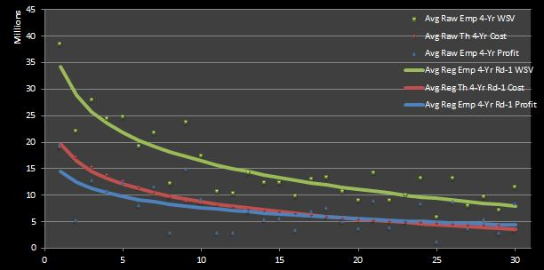
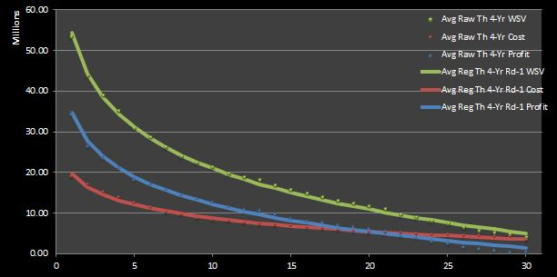

# Indifferent Probability and the NBA Draft

The value of NBA draft picks relative to can be calculated using 
the concept of 
__[indifferent probability](https://en.wikipedia.org/wiki/Principle_of_indifference)__ (IP), a term I 
briefly referenced in a previous chapter highlighting the value 
of information in the context of the NBA draft. I believe that 
IPs can be used to extend my analysis in another chapter
covering how to estimate the value of NBA draft picks.

Specifically, we might use them to learn about which picks are most 
__cost-effective__ and what the trade value of picks is (in terms of other 
picks). In other words, I can find an answer to the second question
__“At which draft slots does the expected basketball production outperform the 
contractual obligation the most?”__) that I posed in my review of existing 
research on the topic of NBA draft pick value, as well as answer to the 
first question (__"What is the relative trade value of picks?"__) 
that I asked in its[follow-up chapter;

However, just as I did in my post discussing the value of perfect information 
and the NBA draft, let me first provide a quick overview IPs in a 
theoretical context.

## Indifferent Probability, in Theory

For those of you who are not as familiar with
__[utility theory](http://www.businessdictionary.com/definition/utility-theory.html)__ 
or __[decision analysis](http://www.prioritysystem.com/glossary1a.html#decisionanalysis)__, IPs are simply 
relative probabilities that define the degree of preference with 
respect to (usually) two other outcomes---one more---desirable and 
one less desirable. IPs are relatively straightforward to 
calculate. An IP is just the __ratio__ of the __difference__ 
between a __given value__ and a pre-defined __minimum value__ with 
the difference of a pre-defined __maximum value__ with the same 
__minimum value__. Less formally, it can be written ```(given value 
- min value) / (max value - min value)```. In reality, we can 
calculate IPs with respect to any two points in a data set as long 
as the value of interest is not be greater than the maximum value 
or less than the minimum value.

A better understanding of IPs is perhaps best acquired through an example. To 
stay within the realm of the sports before considering the application of IPs 
to NBA draft pick value, let us imagine a typical sports fan who has the 
autograph of his favorite player on his favorite team. Now, let's say 
he has the option to play a dual-outcome game of chance in exchange 
for giving up his autographed item. If he wins, then he is granted the 
opportunity to spend an entire day with his favorite player; if he loses, 
then he receives nothing. Clearly, the first outcome is preferable to the 
second. Furthermore, the existing state of possessing the autographed item is 
less preferable to the first and more preferable to the second.

The IP is the likelihood of winning the game (states as a probability) that 
would make the sports fan feel comfortable with (or, more precisely, 
indifferent to) giving up his autographed item and playing the game. If we 
imagine that the fan perceives the first outcome---the opportunity to 
spend a day with his favorite player---to be only slightly more 
preferable to the existing state---possessing the autograph---then 
his IP would be relatively high (e.g. ~0.75 to 1 probability, or ~75% to 100% 
percent chance). Similarly, the IP would be relatively high if the fan 
perceives the second outcome---receiving nothing---is 
significantly less preferable to the existing state.

Intuitively, this should make sense: assuming that the prior two statements 
are true, then the fan would have to know that there is a high probability of 
winning the game of chance because he would strongly despise the outcome if 
he were to lose and only receive a relatively slight bit of enjoyment if he 
were to win. (Note that a high IP only necessitates that only one of the 
prior two statements is true, although its numerical value increases even 
more if both statements are valid.)

## Indifferent Probability for (First-Round) NBA Draft Picks

With this higher-level discussion of IPs out of the way, let's take 
another look at our prior our estimates of the cost, value, and profit of 
first-round NBA draft picks. For reference, in Figure 1 and 2 I 
have reproduced the empirical and theoretical raw and regressed data 
sets shown in figures in my chapter on general NBA draft pick value.


<p id="fig_label">Figure 1: Average Regressed Empirical Four-Year Profit of 1995 --- 2012 First-Round Draft Picks</p>


<p id="fig_label">Figure 2: Average Regressed Empirical Four-Year Profit of 1995 --- 2012 First-Round Draft Picks</p>

Next, Figure 3 shows the results for IPs calculated with respect 
to the maximum and minimum data points in four sets of __win 
shares values__ (WSVs): (1) raw empirical, (2) raw theoretical, 
(3) regressed empirical, and (4) regressed theoretical.


<p id="fig_label">Figure 3: Average Four-Year First-Round WSV IPs</p>

If we use the highest and lowest values in a given 
range of points as our maximum and minimum points, we can actually calculate 
16 different sets of 30 IPs (with one point for each of the 30 first-round 
picks in each data set). ^[ As a 
note to the reader, the next couple of paragraphs discuss nuanced details 
about the IPs that I can calculate with my existing data sets. So, if you 
couldn't care less about these kinds of details, go ahead and skip to 
the next section.] Where does the number 16 come from?

I have four data sets for first-round picks: (1) WS, (2) WSV, (3) cost, and 
(4) profit. Also, we can permute each data set over two options of two 
variations: (1) empirical or theoretical data; (2) raw or regressed data. 
Basically, it comes down to four times two squared. Put even less formally, 
```16 IP sets: 4 data sets * (2 variations) ^ (2 options))```. ^[ As a 
technical note, I have chosen to shown the IP values for WSVs instead of 
those for __win shares__ (WS), cost, or profit because they will be used 
in the upcoming analysis on market inefficiencies.]

In you work out the math for all 16 IPs, you will find that the IPs for WS 
and WSV are nearly identical to one another for both the raw empirical and 
theoretical data. (Intuitively, this makes sense because WSV is just a scaled 
version of WS, and IPs are simply relative probabilities.) Furthermore, the 
four regressed forms of empirical and theoretical variations of data are 
completely coherent (i.e. exactly identical to one another). Thus, there are 
really only 10 unique sets of IPs. Four of these are shown in Figure 1 (i.e. 
the raw and regressed empirical and theoretical WS IPs). Not shown are the 
six other unique sets of IPs: two sets for raw empirical and theoretical 
WSVs, two sets for raw empirical and theoretical WSVs, and two sets for raw 
empirical and theoretical profit. (Recall that the regressed forms of these 
six sets are exactly equivalent to the two sets regressed WSV IPs shown in 
Figure 3.) So what if I lied when I said there were 16 different IP sets.

### Return on Investment (ROI)

Before doing some interesting analysis with our calculated IPs, I want to 
review some of our data regarding value, cost, and profit in order to better 
contextualize my upcoming look on market inefficiencies.

If I may go back to using economics terminology for a moment, I 
can formally prove the notion of
__[diminishing returns](https://en.wikipedia.org/wiki/Diminishing_returns)__ that 
was implied by the profit curves that we saw before.

We can calculate
__[return on investment](http://www.investopedia.com/terms/r/returnoninvestment.asp)__ (ROI), 
which is 
just the quotient of the profit and the cost, to verify that 
higher picks are the most __cost-effective__. Figure 4 depicts the 
ROI found using the raw and regressed theoretical four-year 
profits, as well as the raw theoretical four-year costs. ^[ I have 
chosen to use these data sets for the same reasons outlined in 
detail in the following argument regarding which WSV IPs to use.]


<p id="fig_label">Figure 4: Average Theoretical Four-Year WSV to Cost Ratios (ROI)</p>

The decaying behavior of ROI is not all too surprising, given our prior 
conclusion that top picks are coveted because top-level talent, which is most 
commonly acquired through high first-round draft picks, is extremely 
significant in the NBA, perhaps more so than in any other team sport league. 
My point is to show that top-picks are the most cost-effective.

### Market Inefficiency

So maybe the ROI concept seems like nothing new to you. You’re right, it 
really isn't---it's just a different way of contextualizing 
what we have already seen. Nevertheless, I thought it was important to 
introduce it in order to better understand how we can relate the term 
__“market inefficiency"__ to our discussion.

In particular, I am using the term to distinguish a pick from which the 
profit exceeds the cost correlated with that pick, __relative__ to the rest 
of the picks. The key word to recognize here is “relative”. Although ROI 
proves that the top picks are the most cost-effective, it does so in an 
__absolute__ sense. That is, it doesn’t really distinguish whether or not 
the profit produced at a particular draft slot is greater than what is 
expected by the rookie wage scale.

This is where IPs come back into play---they can be used to identify 
market inefficiencies. In specific, if I take the difference of the IPs for 
WSV and the theoretical four-year cost, then I can pinpoint draft slots where 
player production outperforms that which is dictated by cost. But which of 
the four sets of __WSV IPs__ should I use?

For the sake of argument, let’s neglect the empirical WSVs for right now. I 
can argue that the set of __raw empirical__ WSVs  (the data set with the 
largest standard deviation for each point) are somewhat arbitrary and are 
biased by the drafting team and chosen player. Consequently, the __regressed 
empirical__ WSVs are smoothed out too strongly by my linear-log regression 
to make this data set significant judgement in this nuanced analysis.

That leaves us with the __raw__ and __regressed theoretical__ WSV 
IPs with which to compare to the theoretical cost 
IPs. I think that it is difficult to make a convincing judgement 
call between these two. On one hand, the significance of the raw 
theoretical WSVs is hindered somewhat by its derivation from 
empirical values. They are simply a re-ordering onfthe non-linear, 
non-Guassian distribution of empirical WSV, so they are also 
somewhat random. On the other hand, the regressed theoretical WSV 
set may eliminate the effect of reality to too great of an extent. 
^[In case you were wondering, I have simply chosen the raw 
theoretical four-year cost IPs instead of its regressed 
counterparts because the raw values mirror the actual rookie wage 
scale.]

Why not leave our judgement until we see how each stacks up in 
tabular and graphical form? Figure 5 shows __both theoretica__l 
WSV data sets, along with the cost IPs. Because it is somewhat 
difficult to see where the curves differ the most on their 
descents, I have also graphed the __differentials__ of the IPs in 
Figure 6. Also, in case in you were wondering how the empirical 
WSV points look, Figure 7 is the analogue of Figure 6 with the 
__empirical__ WSV sets (that I said should be neglected) instead 
of their theoretical counterparts.

The market inefficiencies can be defined in Figure 5 as the areas along 
horizontal axis where the cost curve lies above the WSV curve. Likewise, 
these points of interests are the positive values in Figures 6 and 7.


<p id="fig_label">Figure 5: Average __Theoretical__ Four-Year First-Round WSV and Cost __IPs__</p>


<p id="fig_label">Figure 6: Average __Theoretical__ Four-Year First-Round WSV to Cost __IP Differentials__</p>


<p style="fig_label">Figure 7: Average __Emperical__ Four-Year First-Round  WSV to Cost __IP Differentials__</p>

I think the inconsistency between the two empirical WSV lines in 
Figure 7 justifies my prior argument that they should be 
disregarded for this analysis. On the other hand, it is clear that 
the raw and regressed curves in Figure 6 behave in the same 
manner. However, despite their similar behavior, the vertical 
difference between the lines in Figure 6 can lead to somewhat 
different conclusions. If the raw values are accepted, then one 
might deduce that nearly half of the first-round picks 
(specifically, picks 8 through 21) symbolize market 
inefficiencies. On the other hand, if the regressed values are 
taken as a baseline, then one would find that only two first-round 
picks represent true bargains (specifically, the ninth and tenth 
picks).

Thus, it is clear how one can deduce different results dependent 
on which data set is taken as truth. Nevertheless, taking both 
curves in Figure 6 into account, we can infer that mid-first-round 
picks are cost-effective relative to early- and late-first-round 
slots.

## To Be Continued

I believe that this is about as far as I can come in analyzing 
the value of first-round picks in the NBA draft. With the 
conclusion that I drew in the preceding section, I have found an 
answer to the (re-stated) second big question that I asked 
about NBA draft pick value (__“At which draft slots does the 
expected basketball production outperform the contractual 
obligation the most?”__) in a previous chapter.

As for my third question about pick 
trade value, I could use my existing IP sets to tackle this topic, but I 
don't think I would provide meaningful insight because, in my opinion, 
the trade values should encompass both first __and__ second round pick.

Thus, I must attempt to model second-round picks and re-calculate IPs in 
order to give a worthwhile answer to this question. However, I will leave 
this task for another time.
